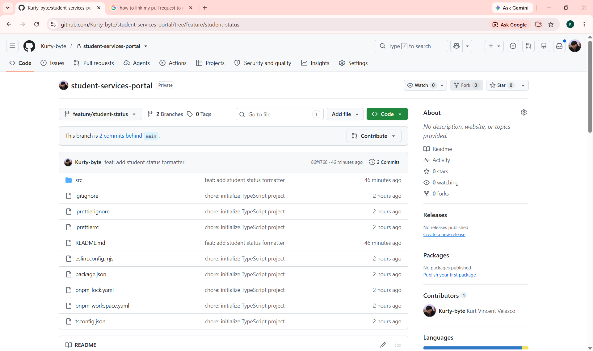
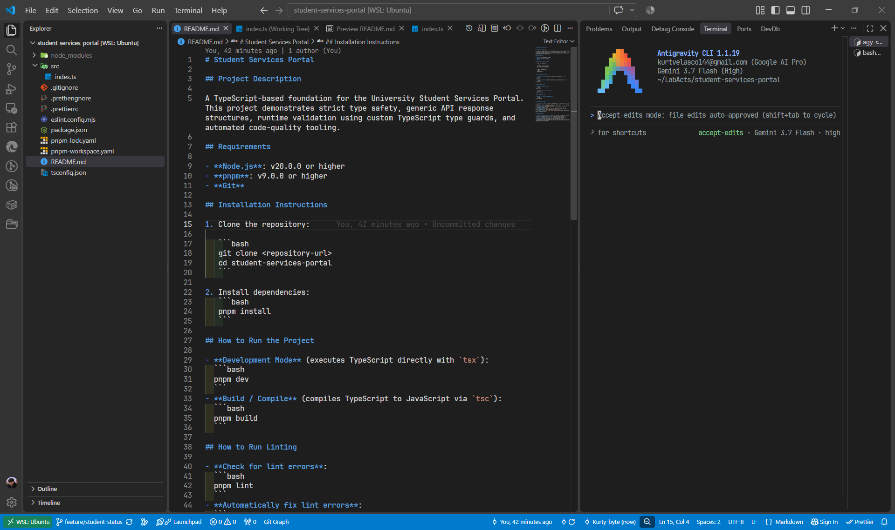

# Student Services Portal

## Project Description

A TypeScript-based foundation for the University Student Services Portal. This project demonstrates strict type safety, generic API response structures, runtime validation using custom TypeScript type guards, and automated code-quality tooling.

## Requirements

- **Node.js**: v20.0.0 or higher
- **pnpm**: v9.0.0 or higher
- **Git**

## Installation Instructions

1. Clone the repository:

   ```bash
   git clone <repository-url>
   cd student-services-portal
   ```

2. Install dependencies:
   ```bash
   pnpm install
   ```

## How to Run the Project

- **Development Mode** (executes TypeScript directly with `tsx`):
  ```bash
  pnpm dev
  ```
- **Build / Compile** (compiles TypeScript to JavaScript via `tsc`):
  ```bash
  pnpm build
  ```

## How to Run Linting

- **Check for lint errors**:
  ```bash
  pnpm lint
  ```
- **Automatically fix lint errors**:
  ```bash
  pnpm lint:fix
  ```

## How to Format Code

- **Format all files using Prettier**:
  ```bash
  pnpm format
  ```

## Development Workflow

### Feature Branch



### Coding & AI-Assisted Development



1. **Branch or Setup**: Create a feature branch (e.g., `feature/student-status`) and ensure dependencies are installed via `pnpm install`.
2. **Develop & Test**: Implement types and functions in `src/`, pairing with Antigravity CLI and running `pnpm dev` to test changes in real-time.
3. **Format Code**: Run `pnpm format` to ensure uniform code style according to Prettier rules.
4. **Lint & Verify**: Run `pnpm lint` to check for syntax and type issues, fixing errors where necessary (`pnpm lint:fix`).
5. **Compile Check**: Run `pnpm build` to ensure error-free compilation before committing and opening a pull request.

## Runtime Validation & Output Examples

Running the project (`pnpm dev`) demonstrates runtime validation, custom type guards, and defensive formatting:

```text
--- Formatted Students (Strict Conversion) ---
101 - Kurt Velasco (Active)
102 - Michaela Endino (Inactive)

--- API Responses ---
Single Student Response:  {
  success: true,
  data: {
    id: 101,
    name: 'Kurt Velasco',
    email: 'kv@gmail.com',
    status: 'active'
  }
}
Student List Response:  {
  success: true,
  data: [
    {
      id: 101,
      name: 'Kurt Velasco',
      email: 'kv@gmail.com',
      status: 'active'
    },
    {
      id: 102,
      name: 'Michaela Endino',
      email: 'me@gmail.com',
      status: 'inactive'
    }
  ]
}

--- Type Guard Validation ---
Valid data is Student:  true
Invalid ID is Student:  false
Missing Name is Student:  false

--- Edge Case Handling (formatStudentStatusSafe) ---
Strict 'active': Active
Strict 'inactive': Inactive
Uppercase 'ACTIVE': Active
Mixed case & whitespace '  Inactive  ': Inactive
Boolean true: Active
Boolean false: Inactive
Null status: Unknown Status
Undefined status: Unknown Status
Invalid number status (1): Unknown Status
Invalid string status ('suspended'): Unknown Status
```

## AI Usage Policy

- **Educational Assistance**: AI tools may be used for ideation, syntax reference, debugging assistance, and conceptual understanding.
- **Code Ownership & Comprehension**: All AI-assisted code must be reviewed, thoroughly understood, and verified by the author.
- **Integrity**: Generated code must not be submitted blindly; all runtime behaviors and type safety guarantees must be tested and validated against project requirements.

## About the Author

- **Name**: Kurt Vincent M. Velasco
- **College Year**: 4th Year
- **Section**: BSIT 4Cx
- **Instructor**: Rinante M. Buntod
- **Subject**: ITSD 85 - Special Topics in Software Development
- **Current Lab Act**: 1
